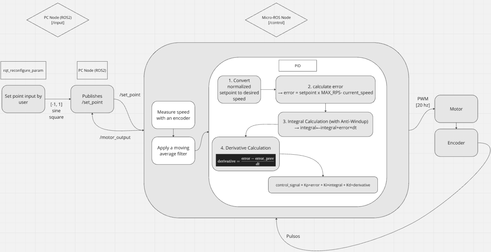
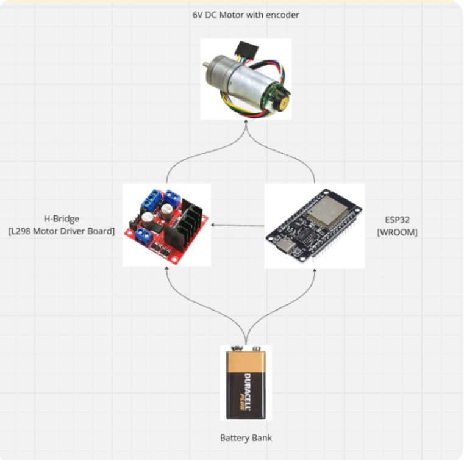
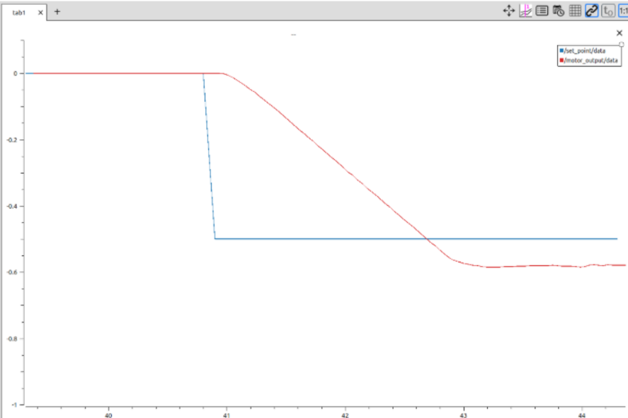
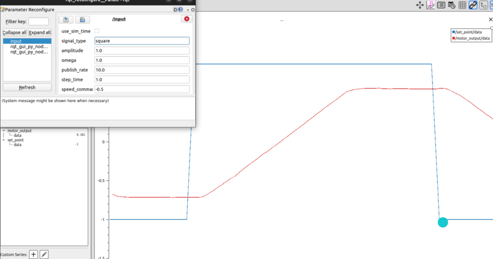
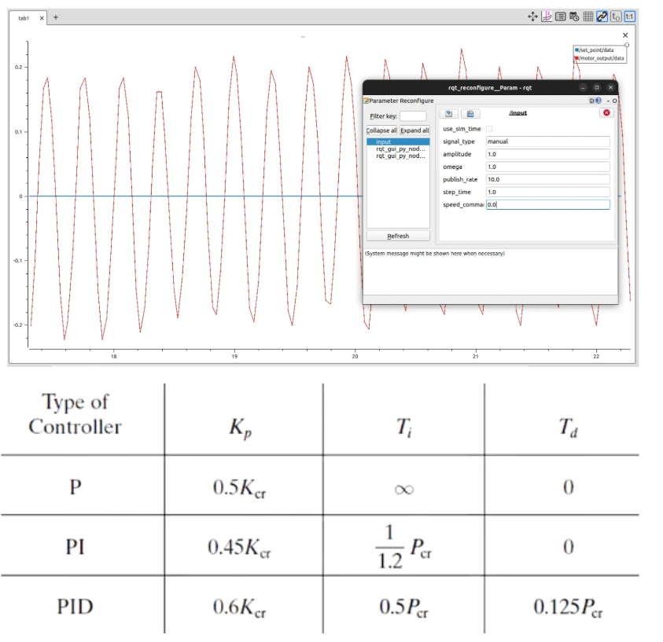
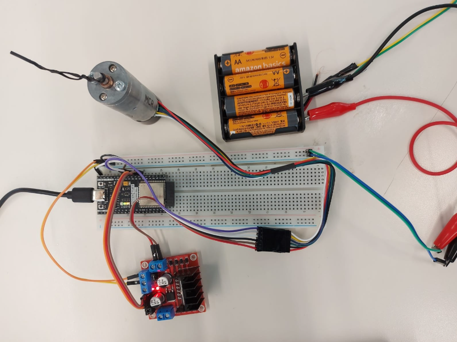

# DC Motor Control

##### PID controller for a 6V DC motor with encoder using ROS2 Humble and MicroROS 

## Overview

This repository contains a project for controlling the speed of a DC motor using a PID controller implemented on an ESP32 microcontroller with micro-ROS integration. The ESP32 communicates in real-time with ROS 2 nodes on a PC, ensuring precise motor speed control through encoder feedback.

## Project Goals

- Implement precise speed control for a DC motor using a PID controller on ESP32.
- Establish real-time communication between ESP32 and ROS 2.
- Ensure stable, efficient, and accurate motor speed control.

## Project Features

- Real-time PID Control: Adjusts PWM signals to control the speed and direction of a DC motor.
- micro-ROS Integration: Allows seamless real-time communication between ESP32 and ROS 2.
- Monitoring: Real-time visualization using PlotJuggler.
- Robustness: Tuning performed using the Ziegler–Nichols method, ensuring stability and efficient performance.

## System Architecture

- A ROS 2 node running on PC sends speed setpoints.
- ESP32 microcontroller node running micro-ROS to control and monitor motor performance.
- Real-time encoder feedback ensures precise speed control.

## Hardware Components

- ESP32-WROOM-32E: Microcontroller used for PID control.
- JGA25-370 DC Motor: Equipped with an integrated encoder for speed feedback.
- L298N H-bridge Driver: Controls motor speed and direction.
- 9V Battery: Provides stable power supply to the motor.

## Software Dependencies

- micro-ROS Arduino: Enables ROS 2 integration with ESP32.
- ROS 2: Provides tools and libraries for real-time communication and monitoring.
- PlotJuggler: Visualization of real-time motor performance data.

## ROS Topics

- `/set_point`: Receives normalized speed commands from the PC.
- `/motor_output`: Publishes normalized motor speed data.
- `/motor_actual_speed` and `/setpoint_actual_speed`: Publish scaled speeds (rev/s).

## Gallery

